# gh-streak-svg
A **minimal, zero-framework GitHub contribution streak SVG generator**.

This service generates a dynamic SVG showing a user’s current GitHub streak using the GitHub GraphQL API.
Designed to be **lightweight**, **cache-friendly**, and **README-embeddable**.

Version: `v1.0.2`

## Features
- **Minimal & Fast** - No frameworks, pure TypeScript, optimized for speed
- **Animated SVG Badges** - Interactive circular progress indicators with smooth animations
- **Dual Metrics** - Shows both current and longest streaks side-by-side
- **Smart Caching** - 1-hour TTL to reduce GitHub API calls
- **Rate Limiting** - Built-in rate limiting (30 requests per minute per user)
- **5-Year History** - Fetches contribution data for the past 5 years
- **Simple API** - Single query parameter needed: `?user=<github-username>`
- **Accurate Tracking** - Properly detects consecutive contribution days

## Usage
To use the service, simply embed the following markdown in your GitHub README (replace `AaryanKhClasses` with your GitHub username):

```markdown

```

### Example
**Live:**


**Example SVG:**



## Build Yourself
### Prerequisites
- Node.js 16+
- [GitHub Personal Access Token](https://github.com/settings/personal-access-tokens) (with public repository read access)

**That's It! No NodeJS Dependencies or Databases Required.**

### Setup
1. **Clone and install the dev-dependency (@types/node)**
```bash
$ npm install
```

2. **Configure GitHub token**
Rename the `.env.example` file in the project root to `.env` and add your token:
```env
GITHUB_TOKEN=your_github_personal_access_token_here
```

3. **Build and run**
```bash
$ npm run build
$ npm start
```

The server starts on `http://localhost:3000`

### Usage
Add the following to your markdown (replace `AaryanKhClasses` with your GitHub username):

```markdown

```

## API
**Endpoint:** `GET /?user=<username>`

### Query Parameters

| Parameter | Type   | Required | Description               |
|-----------|--------|----------|---------------------------|
| `user`    | string | Yes      | GitHub username           |

### Response
- **200 OK** - Returns SVG `image/svg+xml` with streak badge
- **429 Too Many Requests** - Rate limit exceeded (30/min per user)
- **400/404** - Invalid or non-existent username returns error SVG

### Response Headers
```yml
Content-Type: image/svg+xml
Cache-Control: public, max-age=3600
```

## What the Badge Shows
The SVG badge displays:
- **Current Streak** - Consecutive days with contributions (from the most recent)
- **Longest Streak** - Maximum consecutive days with contributions
- **Visual Progress** - Animated circles show how close to completing another 365-day cycle
- **Last Updated** - Timestamp of when the data was last fetched

### Circle Animation
Each complete 365-day cycle is represented by a full circle with a unique color. The circle animates from empty to full, and partial streaks show as partially-filled circles.

### How Streak Calculation Works
1. **Fetch Data** - Retrieves last 5 years of contribution data from GitHub
2. **Deduplicate** - Removes duplicate dates (keeps latest)
3. **Sort & Analyze** - Identifies consecutive contribution days
4. **Calculate Current Streak** - Counts back from recent days (skipping today if no contributions)
5. **Calculate Longest Streak** - Finds the longest consecutive sequence in history

## Caching Behavior
- Responses are cached **in memory** for ~1 hour
- HTTP caching headers (`Cache-Control`) are set
- GitHub README renders are heavily cached by GitHub itself

> [!NOTE]
> New commits may take up to ~1 hour to appear.
> This is intentional to protect API usage and improve performance.

## Performance
- **Response Time** - < 100ms for cached requests, < 1s for fresh requests
- **Caching** - 1-hour TTL per user
- **Rate Limiting** - 30 requests per minute per username
- **Data Freshness** - Updates once per hour

## License
The Project is licensed under the [GNU GPLv3 License](LICENSE).

## Support
Found a bug or have a feature request? Feel free to open an issue!
